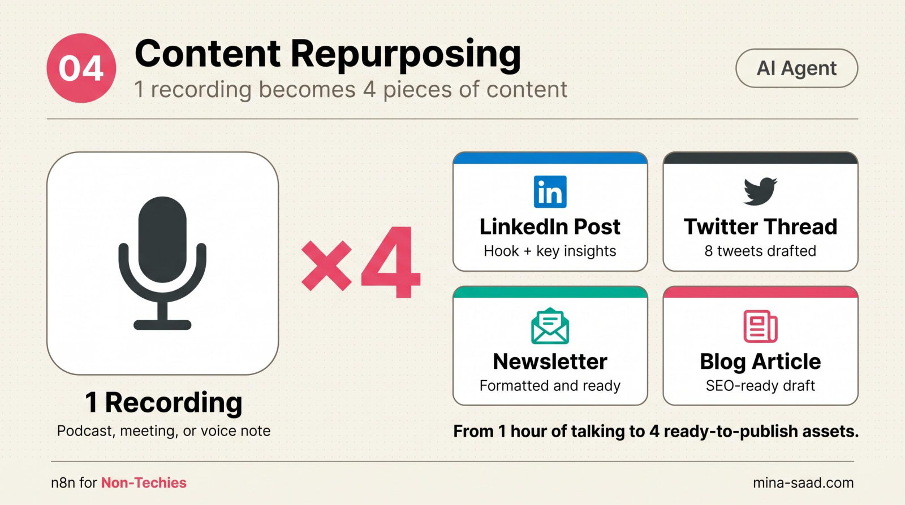

# n8n Content Repurposing

    

> Paste one URL into a webhook. Get back a LinkedIn post, a newsletter section, and a tweet thread, all written in your voice and dropped into a Google Doc for review. The two-hour repurposing job becomes a ten-minute review.

> Part of the **[n8n-ai-agents catalog](https://github.com/MinaSaad1/n8n-ai-agents)** see the catalog for shared [architecture principles](https://github.com/MinaSaad1/n8n-ai-agents/blob/main/docs/architecture-principles.md), [security framework](https://github.com/MinaSaad1/n8n-ai-agents/blob/main/docs/security-framework.md), and [output conventions](https://github.com/MinaSaad1/n8n-ai-agents/blob/main/docs/output-conventions.md) every template in the collection follows.



---

## What it does

- Triggered by a webhook POST: `{ "url": "https://your-blog-post" }`
- Pulls the full article text via Jina.ai's free reader endpoint, no API key needed
- Sends the article to Claude Sonnet 4.6 with a single structured-output prompt
- Gets back three repurposed pieces in one model call: LinkedIn post (150-250 words), newsletter section (200-300 words), tweet thread (5-7 numbered tweets)
- Writes all three drafts into a fresh Google Doc in a folder you choose
- Drops a Slack notification with the doc link so you can review and ship

The workflow does not auto-post anything. The Google Doc is the review surface. You read, edit, publish.

## Architecture

```
POST /webhook/repurpose  { url }
        |
        v
Extract URL  ---  Set node, pulls body.url
        |
        v
Fetch Article  ---  HTTP GET https://r.jina.ai/<url>, plain text
        |
        v
Generate Repurposed Content  ---  Claude chain, structured JSON output
        |
        v
Parse Repurposed Content  ---  Code node, JSON.parse with fallback
        |
        v
Create Google Doc  ---  one doc per run, formatted with section dividers
        |
        +--> Slack notify (doc link)
        +--> Webhook response (doc id)
```

Eight nodes plus a sticky README. One Claude call generates all three formats; the Code node parses the JSON and the Docs node renders it. See [`docs/ARCHITECTURE.md`](docs/ARCHITECTURE.md) for the component-level breakdown and the design decisions behind it.

## Requirements

- **n8n** >= 1.78 (cloud or self-hosted)
- **Anthropic API key** (or OpenRouter, if you swap the LM node) for Claude Sonnet 4.6
- **Google account** with Docs API enabled and a target Drive folder
- **Slack workspace** with a bot user, or any other channel you want to wire in
- **Public webhook URL** if you trigger from outside your n8n instance (use n8n cloud or a tunnel)

Jina.ai's reader is free up to 200 requests per IP per day. No key required at that tier.

## Quickstart

### 1. Clone

```bash
git clone https://github.com/MinaSaad1/n8n-content-repurposing.git
cd n8n-content-repurposing
```

### 2. Import the workflow

1. n8n -> **Workflows** -> **Import from File**
2. Select [`workflows/01-content-repurposing.json`](workflows/01-content-repurposing.json)
3. Open the imported workflow

### 3. Create credentials

| Node | Credential | Notes |
|---|---|---|
| `Claude - Repurpose Model` | Anthropic API | Direct Anthropic key, or swap to the OpenRouter LM node if you prefer that billing surface. |
| `Create Google Doc` | Google Docs OAuth2 | Limit OAuth scope to a specific folder, not your whole Drive. See `docs/SECURITY.md`. |
| `Slack - Doc Ready` | Slack OAuth2 | Bot needs `chat:write` and must be invited to the target channel. |

### 4. Set the Google Drive folder ID

Open the **Create Google Doc** node. Replace `YOUR_GOOGLE_DRIVE_FOLDER_ID` with the folder you want repurposed docs to land in. Grab the ID from the folder's URL (`drive.google.com/drive/folders/<this part>`).

### 5. Set the Slack channel ID

Open the **Slack - Doc Ready** node. Replace `YOUR_SLACK_CHANNEL_ID` with the channel ID where review pings should land. Use a private channel; the doc link is enough for someone with view access to read your repurposed drafts.

### 6. Tune the voice prompt

Open the **Generate Repurposed Content** node. The prompt block has a `VOICE INSTRUCTIONS` line. This is the most important node in the workflow, and it ships with a generic placeholder. Edit it so the model actually sounds like you. Concrete things to add:

- Who you are (role, audience, what you write about)
- Tone rules (direct? formal? casual? avoid which words?)
- 2-3 example outputs from your real LinkedIn or newsletter so the model has few-shot reference
- Hard constraints (no em dashes, no buzzwords, paragraph length, etc.)

Generic prompt = generic output. This step is the difference between drafts you ship and drafts you delete.

### 7. Test

In the workflow editor, click **Listen for test event** on the webhook node, then POST a real article URL:

```bash
curl -X POST https://<your-n8n-instance>/webhook-test/repurpose \
  -H 'Content-Type: application/json' \
  -d '{"url": "https://your-blog-post-url"}'
```

Watch the executions panel. You should see a new Google Doc appear in your folder and a Slack ping within 30-60 seconds.

### 8. Activate

Once the test run looks right, flip the workflow to **Active**. The webhook URL is now live.

## Configuration

- **Notion instead of Google Docs**: replace the `Create Google Doc` node with a Notion `Create Page` node. The `Parse Repurposed Content` node already emits `linkedin_post`, `newsletter_section`, `tweet_thread`, `source_url`, `created_at`, ready to map into Notion properties.
- **Add a video script output**: edit the prompt in `Generate Repurposed Content`. Add a fourth JSON key (`video_script`), describe the format (90-second hook-body-CTA, target platform), then update the `Create Google Doc` node's content template to render it. The Code node passes any extra keys through.
- **Different voice per format**: split into three Claude calls instead of one. Slower and more expensive, but lets you give each format its own voice prompt and few-shot examples. Worth it once one format consistently underperforms the others.
- **Different scraper**: if Jina.ai blocks a site or returns garbage, swap the HTTP node for a Firecrawl, Browserless, or direct HTTP fetch with a custom `User-Agent`.
- **Auto-publish**: don't. The whole point is the human review step. If you really want auto-publish for one format (say, the newsletter), branch off after the Code node and add a Buffer or ConvertKit node, but keep the Google Doc copy as an audit trail.

## Troubleshooting

| Symptom | Cause | Fix |
|---|---|---|
| Webhook returns 200 but nothing happens downstream | Workflow is in test mode and the listener stopped | Activate the workflow, or click `Listen for test event` again. |
| Jina.ai returns empty body | Source site blocks scrapers, or the URL redirects | Try the URL directly in a browser as `https://r.jina.ai/<your-url>`. If empty, swap to Firecrawl or a direct HTTP fetch with a real `User-Agent`. |
| Claude returns invalid JSON, parser falls back to raw text | Model wrapped output in markdown fences or added prose | The Code node already strips ` ```json ` fences. If it still fails, tighten the prompt: explicitly say "Return ONLY a JSON object. No markdown, no prose, no preamble." |
| Google Doc creation errors with `insufficientFilePermissions` | OAuth scope doesn't cover the target folder, or folder ID is wrong | Re-auth with `https://www.googleapis.com/auth/drive.file` scope and verify the folder ID. |
| Slack notification silently drops | Bot not in channel, or wrong channel ID | Invite the bot to the channel. Use the channel ID (starts with `C`), not the channel name. |
| Tweets in the thread go over 280 characters | Prompt didn't enforce a hard cap | Edit the prompt: "Each tweet MUST be under 270 characters including the numbering prefix. Count before you write." |
| Output sounds generic, not like you | Voice prompt is the placeholder | This is the bottleneck. Add 2-3 real examples and explicit tone rules. See step 6. |

## Security

This workflow handles a public webhook, scrapes user-supplied URLs, sends scraped content to a third-party LLM, and writes to your Google Drive. Real risks:

1. **Webhook abuse** anyone with the URL can trigger the workflow and run up your Claude bill
2. **Prompt injection through scraped content** a malicious page can override your voice prompt
3. **SSRF via user-supplied URLs** the workflow happily fetches `http://localhost` or `http://169.254.169.254`
4. **Copyright** the output is a derivative work of someone else's article. Verify rights before publishing.
5. **Google Docs OAuth scope** broad scope means the workflow can read your whole Drive

Threat model and layered defenses in [`docs/SECURITY.md`](docs/SECURITY.md).

## Roadmap

- [ ] Optional video script output (90-sec hook-body-CTA) as a fourth format
- [ ] Per-format voice prompts (split the single Claude call into three)
- [ ] Webhook shared-secret auth header (prevent random POSTs from running up Claude cost)
- [ ] URL allowlist / blocklist node to mitigate SSRF and copyright risk
- [ ] Notion sub-workflow as a drop-in alternative to Google Docs

## License

MIT, see [LICENSE](LICENSE).

## Credits

Built by [Mina Saad](https://github.com/MinaSaad1). Part of the [n8n-ai-agents catalog](https://github.com/MinaSaad1/n8n-ai-agents).

---

## Need this running in your business?

This template is free and MIT, and it is meant to be forked. Getting one into
production against your real data, your credentials and your edge cases is a
different job, and it is the one I do.

I work out what is actually costing a business, then build whatever fixes it: an
AI agent, an automation, or a full application. Handed over so your team owns it.

[Book a call](https://cal.com/minasaad/60min) · [mina-saad.com](https://www.mina-saad.com)
